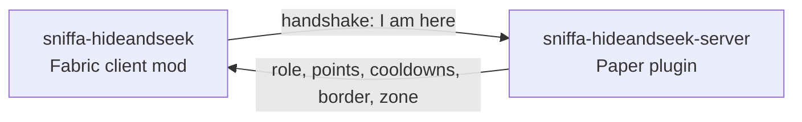

# sniffa-hideandseek

The client mod for the Hide & Seek event - a Fabric mod for Minecraft 1.21.11, installed by hand
by everyone taking part. It draws the ability wheel, the radar and the round display; the server
half is sniffa-hideandseek-server, and without this mod that server will not let you in.

## Installing (players)

1. Install the [Fabric Loader](https://fabricmc.net/use/installer/) for Minecraft 1.21.11.
2. Put `hideandseek-1.0.0.jar` into your `mods` folder. Nothing else is needed: Fabric API, Fabric
   Language Kotlin, GeckoLib and owo-lib are inside the jar.
3. Start the game and press **Join Event** on the title screen.

The mod replaces the title screen: Singleplayer and Multiplayer are hidden while it is installed.
Remove it after the event to get the normal menu back.

## Configuration

`config/hideandseek.properties` is written on first start.

| Key | Default | Effect |
|---|---|---|
| `ping_event_server` | `true` | The title screen pings `event.sniffa.studio` to show whether the event is online. `false` turns that off. |

## How it works

The mod announces itself the moment it connects, and the server will not let anybody in who does
not - that handshake is also the support tool, so people can check their setup days before a show
instead of finding out on the evening.

After that the server does the deciding and pushes down what changed: your role, your points, what
is off cooldown. The mod only draws it. It never works anything out on its own, so two players
never see two different rounds.

## Who talks to whom



Plugin messages on our own channels, nothing else. The mod never asks - it is told, and only
draws what it was told.

## Building

```
./gradlew build
```

The release jar is `build/libs/hideandseek-<version>.jar`. The version comes from
`gradle.properties`. `./gradlew runClient` starts a development client.

## Releasing

1. Raise `version` in `gradle.properties` and add the release to [CHANGELOG.md](CHANGELOG.md).
2. Build the jar.
3. Upload it to Modrinth as described in [MODRINTH.md](MODRINTH.md).

## More

- [STATUS.md](STATUS.md) - where the build stands, both halves, and why it is the way it is.
- [CHANGELOG.md](CHANGELOG.md) - what changed in each release.
- [MODRINTH.md](MODRINTH.md) - everything needed to publish on Modrinth.

## License

MIT, see [LICENSE](LICENSE). The icon and the Sniffa and Marguhl logos are excluded and may not be
reused without permission.
